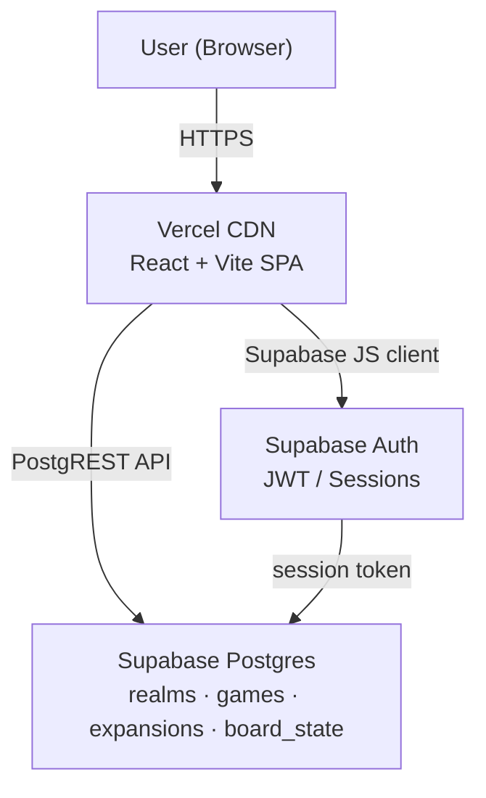
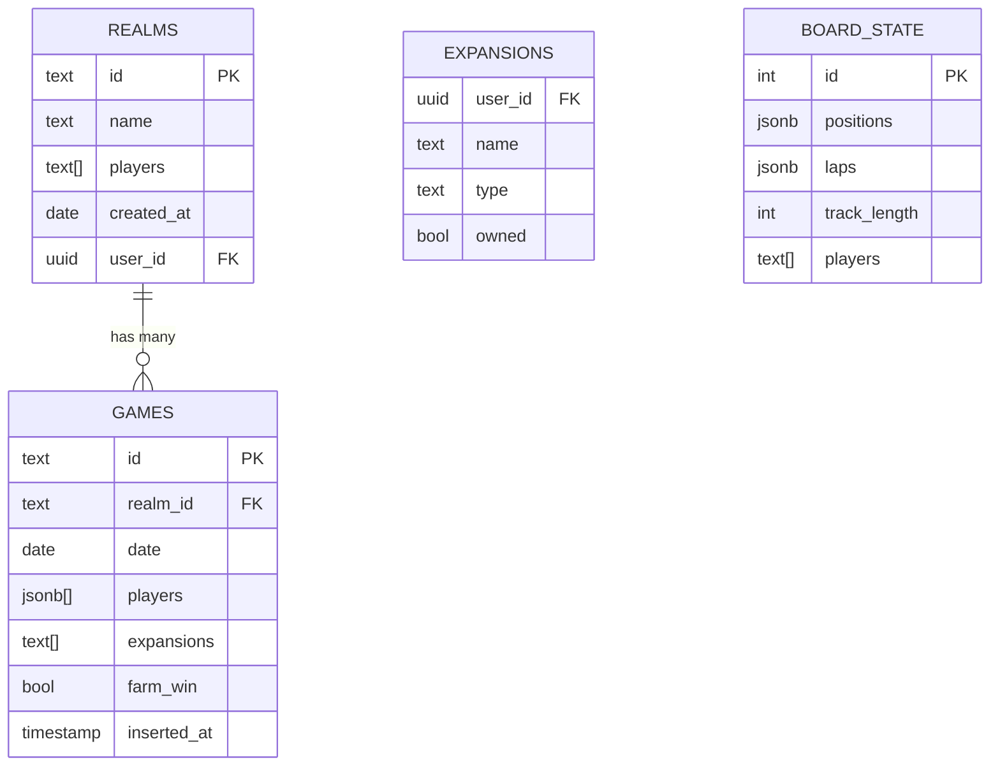
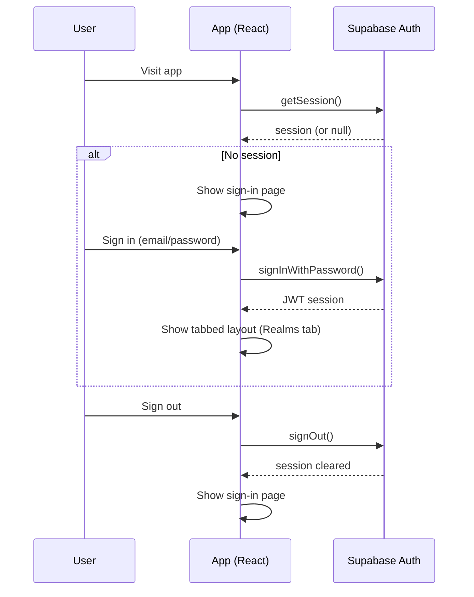
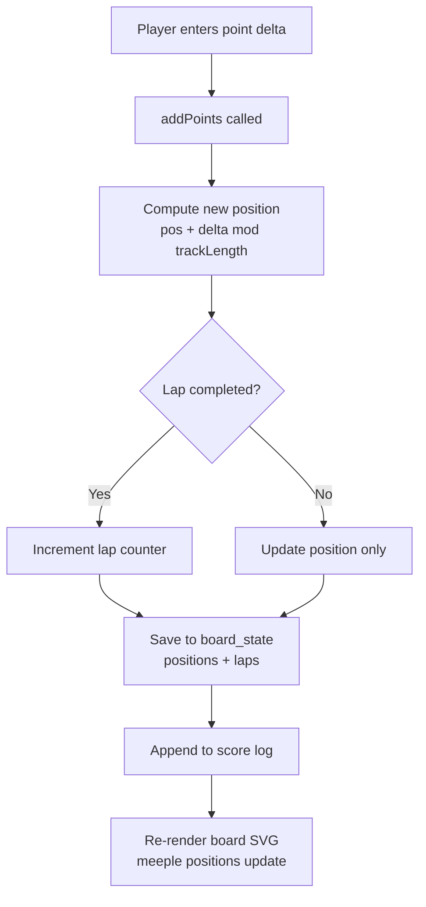

# Meeple Log

A full-stack web app for tracking Carcassonne board game sessions across multiple groups. Supports expansion management, real-time score tracking, game history, and player statistics — all scoped to per-user realms.

**Stack:** React (Vite) · Supabase (Postgres + Auth) · Vercel

---

## Table of Contents

1. [Project Overview](#1-project-overview)
2. [Architecture Overview](#2-architecture-overview)
3. [Visual Diagrams](#3-visual-diagrams)
4. [Database Design](#4-database-design)
5. [Game Flow](#5-game-flow)
6. [Authentication](#6-authentication)
7. [Deployment](#7-deployment)
8. [Local Development](#8-local-development)
9. [Future Improvements](#9-future-improvements)

---

## 1. Project Overview

Meeple Log is a multi-tenant score tracking app built for groups who play Carcassonne regularly. Each group operates within a **Realm** — an isolated space with its own players, game history, standings, and expansion configuration.

**Core features:**

| Feature | Description |
|---|---|
| Realms | Per-user isolated game groups; only realms you created are visible to you |
| Score Board | Live position tracking on a 50-point track with lap counting |
| Meeple Picker | Each player selects a character meeple before each game |
| Expansions | Per-user collection management; each user's owned expansions are independent |
| Logbook | Filterable game history (date, winner, margin); click any row to open match detail lightbox |
| Statistics | Per-realm statistics: wins, streaks, high scores, farm , clutch factor |
| Auth | Sign-in page shown when signed out; tabbed layout only visible to authenticated users |

---

## 2. Architecture Overview

```
Browser (React SPA)
        │
        │  HTTPS
        ▼
  Vercel CDN / Edge
  (static build output)
        │
        │  Supabase JS client
        ▼
  Supabase Platform
  ┌─────────────────────┐
  │  Auth (JWT sessions) │
  │  Postgres (data)     │
  └─────────────────────┘
```

**Data flow:**

1. User loads the app from Vercel's CDN (static React bundle).
2. Supabase JS client resolves the existing session from `localStorage`.
3. All reads/writes go directly from the browser to Supabase via its REST/PostgREST API — no custom backend server.
4. Auth state changes (sign in, sign out) are broadcast via `onAuthStateChange` and update React state immediately.

---

## 3. Visual Diagrams

### System Architecture



### Database Schema



### Auth Flow



### Scoring Flow



---

## 4. Database Design

### Schema rationale

**`games.players`** is stored as a `jsonb[]` array rather than a normalised `players` table. Each element holds `{ name, score, meeple }` for a single game. This avoids joins for the common read path (rendering the logbook) and keeps game records self-contained.

**`games.expansions`** is a `text[]` column listing the expansion names active during that game. This allows straightforward AND-filtering in the logbook without a join table.

**`realms.password_hash`** column exists in the schema but is unused — realms are scoped to the authenticated user and require no password.

### Example records

**realms**

```json
{
  "id": "ABCD1234",
  "name": "The Keep",
  "players": ["Poojan", "Diya"],
  "created_at": "2026-01-15"
}
```

**games**

```json
{
  "id": "1706000000000-x7k2m",
  "realm_id": "ABCD1234",
  "date": "2026-02-20",
  "players": [
    { "name": "Poojan", "score": 94, "meeple": "blue.png" },
    { "name": "Diya",   "score": 87, "meeple": "red.png"  }
  ],
  "expansions": ["Inns & Cathedrals", "The River"],
  "farm_win": false
}
```

---

## 5. Game Flow

### Navigation

The app has two top-level views:
- **Sign-in page** — shown when the user is not authenticated
- **Tabbed layout** — shown when authenticated; 5 tabs always visible: **Realms · Statistics · Logbook · Game Board · Collection**

Auth state is derived purely from the Supabase user object — there is no separate `phase` state.

### Realms tab

The Realms tab is the landing page after sign-in. It shows:
- The currently active realm (name + players) if one is loaded
- **Load Realm** — opens the realm list; selecting a realm sets it as active and returns to the landing
- **Create New Realm** — form to create a realm (name must be unique per user); on submit returns to landing

Realm behaviour:
- Deleting the active realm clears it from the session
- Deleting the last realm resets to the landing; deleting a non-last realm stays in the realm list
- Statistics, Logbook, and Game Board all show an empty state when no realm is loaded

### Pre-game setup

1. With a realm loaded, navigate to the **Game Board** tab.
2. Players choose their meeple characters. Defaults seed from the previous game's selections.
3. Active expansions are confirmed on the next step; only owned expansions are shown.

### Live scoring

The board uses a **50-point circular track** (configurable via `trackLength`). Each player has:
- `position` — current cell (0–49)
- `laps` — number of full circuits completed

**Total score = `laps × trackLength + position`**

Points are added via a numeric input or quick-add buttons (+1, +2, +3). Every move is appended to a score log with timestamp, and the full undo history is kept in memory for the session.

### Finishing a game

Clicking **Final Scoring** snapshots final scores and navigates to the **Final Scores** form. The player can:
- Confirm the date
- Mark a **Farm Win** (pig icon shown in logbook)
- Record the game to the Supabase `games` table

Clicking **← Back** returns to the live board with scores intact (board state is not reset until a new game starts).

### Logbook

Filterable game history table (date, winner, margin). Filters by expansion using AND logic. Clicking a row opens a **match detail lightbox** showing:
- Full date, winner, point margin
- Per-player scores
- Expansions played

Lightbox keyboard controls: `Esc` / `Space` to close; `↑` / `↓` to navigate between entries with a slide animation.

### Statistics

Per-player cards showing: wins, losses, ties, win rate, high score, current streak, farm, clutch factor, biggest blowout, net point differential. The leader card displays `crown.png`. Cards are sorted by win rate (tiebroken by total wins).

---

## 6. Authentication

Supabase Auth handles identity. The app uses email/password sign-in via the Supabase JS client.

| Behaviour | Detail |
|---|---|
| Session persistence | JWT stored in `localStorage` by the Supabase client |
| Front page | Sign-in screen shown when not authenticated; no tabs visible |
| Per-user realms | Only realms created by the signed-in user appear in "Load Realm" |
| Per-user collection | Each user's expansion ownership is stored independently in `expansions` |
| Sign out | Clears session and returns to sign-in page |

Auth state is kept in sync via `supabase.auth.onAuthStateChange`, which updates React state reactively without polling.

---

## 7. Deployment

The app is deployed as a static SPA on **Vercel**.

```
Production URL  →  used in Supabase allowed origins + Auth redirect URLs
Preview URLs    →  auto-generated per branch/PR (e.g. carcassonne-abc123.vercel.app)
Local dev       →  http://localhost:5173 (Vite dev server)
```

**Important:** Only the production URL should be added to Supabase's **Authentication → URL Configuration** (Site URL + Redirect URLs). Preview deployment URLs will not work with Supabase Auth unless explicitly added.

Vercel build settings:

| Setting | Value |
|---|---|
| Framework preset | Vite |
| Build command | `npm run build` |
| Output directory | `dist` |
| Environment variables | `VITE_SUPABASE_URL`, `VITE_SUPABASE_ANON_KEY` |

---

## 8. Local Development

**Prerequisites:** Node.js 18+, npm, a Supabase project.

```bash
git clone <repo-url>
cd meeple-log
npm install
```

Create `.env.local` in the project root:

```
VITE_SUPABASE_URL=https://<your-project>.supabase.co
VITE_SUPABASE_ANON_KEY=<your-anon-key>
```

Both values are safe to expose client-side (they are the public anon key, not the service role key).

```bash
npm run dev       # start dev server at http://localhost:5173
npm run build     # production build → dist/
npm run preview   # serve the dist/ build locally
```

**Required Supabase tables:** `realms`, `games`, `expansions`, `board_state`. See the schema in §4 for column definitions.

**Required schema migrations** (run in Supabase SQL editor):

```sql
-- Per-user realms
ALTER TABLE realms ADD COLUMN IF NOT EXISTS user_id uuid REFERENCES auth.users(id);

-- Per-user expansions
ALTER TABLE expansions ADD COLUMN IF NOT EXISTS user_id uuid REFERENCES auth.users(id);
ALTER TABLE expansions DROP CONSTRAINT IF EXISTS expansions_pkey;
ALTER TABLE expansions ADD CONSTRAINT expansions_name_user_id_key UNIQUE (name, user_id);
```

---

## 9. Future Improvements

- **Row-level security (RLS):** Add Supabase RLS policies so realm/expansion data is only readable/writable by the owning user, enforcing per-user scoping at the database level instead of only in the client query.
- **Real-time updates:** Use Supabase Realtime to sync score changes across devices during a live game session.
- **Export / backup:** Allow realm owners to download a full JSON export of their game history.
